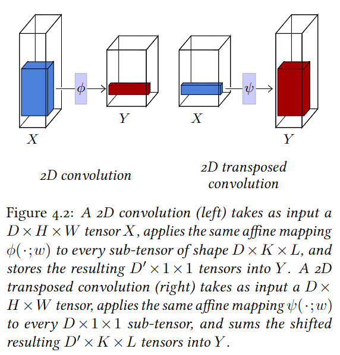

# AIGC 求职面试指南

📚 AIGC 求职面经、必备基础知识、提示词工程、大模型、提示词工程师、ChatGPT、Stable Diffusion、Prompt、Embedding、Fintune 等 AIGC 求职你所需要知道的一切~

**持续更新中，欢迎分享求职经历、内推、工作机会等信息，欢迎共同编辑完善本项目，祝大家求职顺利~**

## 目录
- [AIGC 求职面试指南](#aigc-求职面试指南)
  - [目录](#目录)
  - [前言](#前言)
  - [面经](#面经)
    - [算法方向](#算法方向)
      - [观点](#观点)
    - [提示词方向](#提示词方向)
      - [观点](#观点-1)
  - [学习资源](#学习资源)
    - [学习路径](#学习路径)
    - [AIGC 知识库](#aigc-知识库)
    - [文章](#文章)
    - [提示词学习](#提示词学习)
    - [OpenAI 官方教程](#openai-官方教程)
    - [GPT 应用开发—— LangChain 相关资源](#gpt-应用开发-langchain-相关资源)
  - [AI 基础(算法方向)](#ai-基础算法方向)
    - [GPT 论文](#gpt-论文)
    - [深度学习入门「口袋书」](#深度学习入门口袋书)
    - [AI 基础(其他方向)](#ai-基础其他方向)
  - [开源与合作](#开源与合作)
    - [📜 协议](#-协议)
    - [🤝 合作](#-合作)
  - [致谢](#致谢)

## 前言

>   最近秋招，许多同学朋友都在焦虑找工作的事情，近年来经济下行，就业机会减少，找工作确实是一件不容易的事情。因为 AIGC 领域的火热，最近许多朋友向我咨询过提示词工程师这一职业的事宜，发现这方面求职的相关资料较少，系统性资料更是不多。由于一直关注 AIGC 领域，同时也在运营提示词社群的缘故，对这些方面的内容零零散散有些了解，因此将这些内容收集整理起来，以期能对正在求职的朋友有所帮助。
> 
>   同时，也要说明，这个行业目前也存在诸多不确定性，并不是无脑推荐大家涌入这个行业，只是若你在求职时处处碰壁，可以考虑这方面的机会，目前来看，这是一个相对而言机会多一些的行业。

AIGC 算法方向前景争议不大，但是关于提示词工程师职业前景却存在诸多争议，关于提示词工程师的工作机会我很赞同下面的话：

> 时代给普通人的上升机会本就稀少，通过容易上手的“写提示词”技能作为“跳板”，进入行业之后再提升自己，“提示工程师”是非常好的路径。从可能会被消灭的“写提示词”型工程师，转变成真正掌握了算法优化、开发、落地部署的“提示工程”，那才是成功的转型。

## 面经

### 算法方向
* [我的大模型岗位面试总结：共24家，9个offer](https://hub.baai.ac.cn/view/31151)
* [OpenAI，面试总结（非面经），挂了。](https://zhuanlan.zhihu.com/p/658886757)

* [用Chatgpt复习算法工程师面试系列--AIGC算法篇](https://zhuanlan.zhihu.com/p/628438318)
* [【LLM】大模型面试准备-2（题库整理篇）](https://zhuanlan.zhihu.com/p/651147548)
* [分享俩挂得很彻底的挂经，xAI & 英伟达，](https://zhuanlan.zhihu.com/p/658685266)
* [深度学习算法面试常见基础问题（2）AIGC相关问题](https://zhuanlan.zhihu.com/p/628253030)
* [算法面试-深度学习基础面试题整理-AIGC相关（2023.9.01）](https://blog.csdn.net/qq_43687860/article/details/132626754)
* [国内大模型公司，粗略面经+感受+一些包裹](https://zhuanlan.zhihu.com/p/657826357)
* [2024届暑期实习蚂蚁一面面经（AIGC）](https://www.nowcoder.com/discuss/465528395846197248)
* [AIGC算法工程师](https://www.nowcoder.com/feed/main/detail/41dfecd495324a1d8d51bdddd3ddb4bc)
* [手把手教你如何成为AIGC算法工程师（持续更新）](https://zhuanlan.zhihu.com/p/651076114)

#### 观点

* [ChatGPT这么强，会影响NLPer的就业环境吗](https://zhuanlan.zhihu.com/p/605673596)

### 提示词方向

* [刘海：「AI 提示词工程师」の 见解和经验分享](https://waytoagi.feishu.cn/wiki/Gn1swDSxei4EB0kNu5bcfTvdnIb)
* [5家大厂AIGC：百度&腾讯&科大讯飞&商汤&蚂蚁金服AI产品经理面经大汇总（已offer）](https://zhuanlan.zhihu.com/p/655031112)
* [Prompt 工程师指南 [高阶篇]：对抗性 Prompting、主动 prompt、ReAct、GraphPrompts、Multimodal CoT Prompting 等](https://xie.infoq.cn/article/a55192a58c1880e82dbb58df7) Prompt 工程师需要掌握的高阶能力
* [设计师的AIGC面试题，阁下如何应对？-（上篇）](https://www.woshipm.com/ai/5858859.html)
* [6个常见的 AIGC 相关面试问题，范例答案来了！](https://www.uisdc.com/aigc-3)
* [字节AIGC产品经理真题面试｜全程高能](https://zhuanlan.zhihu.com/p/658602974)

#### 观点

关于提示词工程师职业，有许多不同的声音，收集各方文章供君参考

|名称|简介|备注|
|---|---|---|
|[实访用人单位：Prompt 工程师真是低门槛“香饽饽”？](https://www.infoq.cn/article/7fgaffffykbmxw11u0bt)|相对来说，现在的 Prompt 工程师入门门槛，可能是历史最低值，是入行的好时机。Prompt 工程师并非一个“麻瓜”可以随便上手的工作，且未来可能越来越难。|-|
|[Prompt 工程师指南 [高阶篇]：对抗性 Prompting、主动 prompt、ReAct、GraphPrompts、Multimodal CoT Prompting 等](https://xie.infoq.cn/article/a55192a58c1880e82dbb58df7)|Prompt 工程师需要掌握的高阶能力|-|
|[年薪六位数，AI提示词工程师成为热门新职业](https://36kr.com/p/2293212182173440)|提示词工程师是「让新一代生成性人工智能应用程序（如 ChatGPT 或 Google Bard ）做人类想要让他们去做的事情」的专家。|-|
|[大模型带火新职业，“会咒语的那群人”能走多远](https://weibo.com/ttarticle/p/show?id=2309354937823873532067)| ChatGPT等大模型的火爆带火了“提示词工程师”这个新职业。有人将“提示词工程师”称为“会咒语的那群人”。据了解，目前国内各大招聘平台上名为“Prompt 工程师”或“Prompt Engineer”的职位月薪大多在1.5万-6万元。尽管对于其是一个新职业还是临时工种还有不少争议，但不可否认的是，诸如提示词工程师一类的AIGC相关职业正在蓬勃发展。|-|
|[不超过39k，AIGC美术人才薪资天花板怎么来的](https://36kr.com/p/2219530106823940)|根据厂商发布信息来看，AIGC岗位薪资基本在10k-30k左右。此外，像AIGC算法工程师，最高薪资甚至达到了百万级别。而这也与今年就业难的游戏行业常规招聘市场，形成了鲜明反差。|-|
||||
|[普通人转行“提示工程师”毫无意义](https://www.woshipm.com/zhichang/5878492.html)|提示工程师（Prompt Engineer）职业祛魅指南。时代给普通人的上升机会本就稀少，通过容易上手的“写提示词”技能作为“跳板”，进入行业之后再提升自己，“提示工程师”是非常好的路径。|-|
|[AIGC招聘实火还是虚火？](https://xueqiu.com/1795547425/249558848)|AI相关岗位招聘火热，高薪吸引众多求职者。但AI创业领域存在争议，部分被认为仅是蹭热点，真假机遇仍待鉴别。|-|
|[6个月时间，百万年薪的提示词工程师光速失业](https://m.jiemian.com/article/9459888.html)|这是一场关于信息差的游戏，其中包含着迷茫与焦虑，激动与振奋。|-|
|[请别造新词了，未来不会有什么Prompt工程师](https://m.huxiu.com/article/1133932.html)|与其说，懂 Prompt 是核心竞争力，不如说，沟通能力才是核心竞争力。|-|
|[真实的 AIGC 就业现状：遭面试官鄙视，给一般的薪水干更多的活](https://www.8btc.com/article/6828912)|铁打的打工人，流水的新风口。|-|

## 学习资源

### 学习路径
待补充

### AIGC 知识库
* [通往 AGI 之路](https://waytoagi.feishu.cn/wiki/QPe5w5g7UisbEkkow8XcDmOpn8e)
* [LangGPT 结构化提示词](https://aq92z6vors3.feishu.cn/wiki/RXdbwRyASiShtDky381ciwFEnpe)
* [💡Learn Prompting](https://learnprompting.org/zh-Hans/)
* [ChatGPT 中文指南](https://github.com/yzfly/awesome-chatgpt-zh)

### 文章

|名称|简介|备注|
|---|---|---|
|[AI Agents大爆发：软件2.0雏形初现，OpenAI的下一步](https://mp.weixin.qq.com/s/Jb8HBbaKYXXxTSQOBsP5Wg)|Lilian Weng 的个人博客文章，Lilian 现在是 OpenAI 的 Head of Safety Systems，之前还领导过 OpenAI 的 Applied AI 团队。AI Agent 被认为是 OpenAI 发力的下一个方向。OpenAI 的联合创始人 Andrej Karpathy 在近期的一次公开活动上提到“相比模型训练方法，OpenAI 内部目前更关注 Agent 领域的变化，每当有新的 AI Agents 论文出来的时候，内部都会很兴奋并且认真地讨论”，而在更早之前，Andrej  还评价 AutoGPT 是 Prompt Engineering 下一阶段的探索方向。|[英文原文](https://lilianweng.github.io/posts/2023-06-23-agent/)|
|[《综述：全新大语言模型驱动的Agent》——4.5万字详细解读复旦NLP和米哈游最新Agent Survey](https://zhuanlan.zhihu.com/p/656676717)|复旦NLP团队和米哈游一起出的《TITLE：The Rise and Potential of Large Language Model Based Agents: A Survey》论文一个翻译版本，作者同时对部分内容进行了删繁就简，总结概括。|[论文原文](https://arxiv.org/pdf/2309.07864v1.pdf)|
|[LangChain Agents - Joining Tools and Chains with Decisions](https://www.youtube.com/watch?v=ziu87EXZVUE&ab_channel=SamWitteveen)|LangChain Agents--将工具和任务链与决策结合起来|英文 Youtube 视频，LangChain 项目官方对预置的 agents 介绍。|-|

### 提示词学习

|名称|Stars|简介|备注|
|---|---|---|---|
| [吴恩达《面向开发者的 ChatGPT 提示词工程》](https://learn.deeplearning.ai/)|-| DeepLearning.ai 创始人吴恩达与 OpenAI 开发者 Iza Fulford 联手推出了一门面向开发者的技术教程：《**ChatGPT 提示工程**》|[《面向开发者的 ChatGPT 提示词工程》非官方版中英双语字幕](https://github.com/GitHubDaily/ChatGPT-Prompt-Engineering-for-Developers-in-Chinese) - **中文视频地址：[面向开发者的 ChatGPT 提示词工程](https://space.bilibili.com/15467823/channel/seriesdetail?sid=3247315&ctype=0)** - **英文原视频地址：[ChatGPT Prompt Engineering for Developers](https://learn.deeplearning.ai/)**|
|[Prompt engineering techniques](https://learn.microsoft.com/en-us/azure/cognitive-services/openai/concepts/advanced-prompt-engineering?pivots=programming-language-chat-completions)|-|微软官方教程,介绍了 Prompt 设计和工程中的一些高级玩法，涵盖系统消息、少样本学习、非聊天场景等内容。|-|
|[高质量导师提示词 Mr.-Ranedeer-AI-Tutor](https://github.com/JushBJJ/Mr.-Ranedeer-AI-Tutor)||A GPT-4 AI Tutor Prompt for customizable personalized learning experiences.|极具参考价值的提示词|
|[结构化提示词 LangGPT](https://github.com/yzfly/LangGPT)||LangGPT: Empowering everyone to become a prompt expert!🚀 Structured Prompt，结构化提示词。|使用结构化方式写高质量提示词|

### OpenAI 官方教程

|名称|Stars|简介|备注|
|---|---|---|---|
|[GPT best practices](https://platform.openai.com/docs/guides/gpt-best-practices)|-|OpenAI 官方教程,使用 GPT 的最佳实践|-|
|[openai-cookbook](https://github.com/openai/openai-cookbook)||Examples and guides for using the OpenAI API|OpenAI API 官方使用指南|
|[openai-python](https://github.com/openai/openai-python)||The OpenAI Python library provides convenient access to the OpenAI API from applications written in the Python language.|OpenAI python 接口|
|[Best practices for prompt engineering with OpenAI API](https://help.openai.com/en/articles/6654000-best-practices-for-prompt-engineering-with-openai-api)|-|OpenAI 官方教程,介绍了 Prompt 工程中最佳实践|-|

### GPT 应用开发—— LangChain 相关资源

|名称|Stars|简介|备注|
|---|---|---|---|
|[langchain](https://github.com/hwchase17/langchain)||Building applications with LLMs through composability|开发自己的 ChatGPT 应用|
|[langchain-aiplugin](https://github.com/langchain-ai/langchain-aiplugin)||-| langChain 插件|
|[LangFlow](https://github.com/logspace-ai/langflow)||LangFlow is a UI for LangChain, designed with react-flow to provide an effortless way to experiment and prototype flows.|LangChain的一个UI|
|[langchain-tutorials](https://github.com/gkamradt/langchain-tutorials)||Overview and tutorial of the LangChain Library|LangChain 教程|
|[LangChain 教程](https://www.deeplearning.ai/short-courses/langchain-for-llm-application-development/)|-|-|吴恩达与 LangChain 开发者推出的教程，目前免费|
|[LangChain 的中文入门教程](https://github.com/liaokongVFX/LangChain-Chinese-Getting-Started-Guide)||LangChain 的中文入门教程|gitbook地址：https://liaokong.gitbook.io/llm-kai-fa-jiao-cheng/|
|[langchain-ChatGLM](https://github.com/imClumsyPanda/langchain-ChatGLM)||langchain-ChatGLM, local knowledge based ChatGLM with langchain |基于本地知识库的 ChatGLM 问答|
|[awesome-langchain](https://github.com/kyrolabs/awesome-langchain)||😎 Awesome list of tools and projects with the awesome LangChain framework. |LangChain Awesome 资源列表。|

## AI 基础(算法方向)
* [一文读懂ChatGPT模型原理](https://zhuanlan.zhihu.com/p/589621442)
* [ChatGPT/InstructGPT详解](https://zhuanlan.zhihu.com/p/590311003) ChatGPT和InstructGPT在模型结构，训练方式上都完全一致，即都使用了指示学习（Instruction Learning）和人类反馈的强化学习（Reinforcement Learning from Human Feedback，RLHF）来指导模型的训练。要搞懂ChatGPT，我们必须要先读懂InstructGPT。

### GPT 论文
|名称|简介|备注|
|---|---|---|
|[Improving Language Understanding by Generative Pre-Training](https://cdn.openai.com/research-covers/language-unsupervised/language_understanding_paper.pdf)|Generative Pre-Training方法通过预训练语言模型和Fine-tuning微调，可以在多个自然语言理解任务上取得最新的最佳性能。 与其他自然语言处理方法和技术相比，Generative Pre-Training方法具有更好的泛化能力、更高的效率和更少的标记数据需求。|GPT-1 论文。有意思的是，GPT1的论文在投稿的时候并不是一帆风顺，甚至几番被拒稿并且从未被任何顶会接受。其中一个原因便是GPT1的模型在架构上几乎没有任何的创新。|
|[Language Models are Unsupervised Multitask Learners](https://cdn.openai.com/better-language-models/language_models_are_unsupervised_multitask_learners.pdf)|探索了更大规模的模型在ZERO-SHOT的情况下的表现，没有使用任何微调，仅靠预训练+提示+预测就在8/9个任务里达到了SOTA。|GPT-2 论文|
|[Language Models are Few-Shot Learners](https://arxiv.org/pdf/2005.14165.pdf)|从一开始的大模型预训练的引导者，到后面转为在无适配的FEW-SHOT泛化能力方向的引导者。|GPT-3 论文|
|[GPTV_System_Card](resources/GPTs/GPTV_System_Card.pdf)|GPT Vision System Card。|GPT-4 多模态模型报告|

论文解读：

* [GPT系列论文阅读笔记](https://zhuanlan.zhihu.com/p/412351920)
* [GPTV 解读](https://zhuanlan.zhihu.com/p/658422471)

### 深度学习入门「口袋书」

* [PDF 下载](resources/TheLittleBookofDeepLearning.pdf)

深度学习入门「口袋书」，作者是法国计算机视觉专家 François Fleuret，用130多页概括了深度学习的主要内容，简洁明了。这本小册子非常适合放在手边，在需要时快速回顾关键概念。小册子的插图、工具、代码等都非常简洁优美，一目了然。

### AI 基础(其他方向)
* [ChatGPT新手必看-基础篇：全面介绍ChatGPT领域的知识（值得收藏）](https://zhuanlan.zhihu.com/p/634161684)
* [一文读懂ChatGPT模型原理](https://zhuanlan.zhihu.com/p/589621442)

## 开源与合作
🔗 本项目为  [EmbraceAGI](https://github.com/EmbraceAGI) 开源社区项目， [EmbraceAGI](https://github.com/EmbraceAGI) 开源社区欢迎一切有志开源的朋友参与共创共建 AI 时代开源社区！

### 📜 协议

🔗 本项目使用 [CC BY-NC-SA 4.0（知识共享-署名-非商业性使用-相同方式共享 4.0 国际）](https://creativecommons.org/licenses/by-nc-sa/4.0/deed.zh) 协议开源。

### 🤝 合作

* [经验分享] 如果您已经有 AIGC 领域求职经验，欢迎您分享您的笔试、面试经验、职位需求等等相关经验
* [开源共建] 您可以通过下面几种方向参与开源共建
  * 共同编辑、维护本项目
  * 共建共创 EmbraceAGI 开源社区
* [工作机会] 若贵司有 AIGC 相关招聘、内推信息，欢迎在本项目发布

有意者请通过 PR， Issue 或者下面的方式联系我。

💌 联系

项目作者——[云中江树]()，相关开源项目：

- [🔥 ChatGPT 中文指南（8K+ ⭐）](https://github.com/yzfly/awesome-chatgpt-zh)
- [🚀 结构化提示词 LangGPT —— 让人人都可快速编写高质量 Prompt! (2K ⭐)! ](https://github.com/yzfly/LangGPT)
- [🔥 中文 prompt 精选 (1K+ ⭐) ](https://github.com/yzfly/wonderful-prompts)

如有任何疑问或建议，请通过以下方式联系我：

- 📧 Email: [云中江树](mailto:contact@embraceagi.com)
- 📞 微信：zephyr_ai (添加请注明来意)
- 🌏 微信公众号: [清歌流觞](https://mp.weixin.qq.com/s/N9BrkDqvkIHQD7TTnhNk6Q)

🌟 感谢您的关注和参与，祝您求职顺利！ 🌟

## 致谢
* [EmbraceAGI](https://github.com/EmbraceAGI) 感谢 EmbraceAGI 社区对本项目的支持!